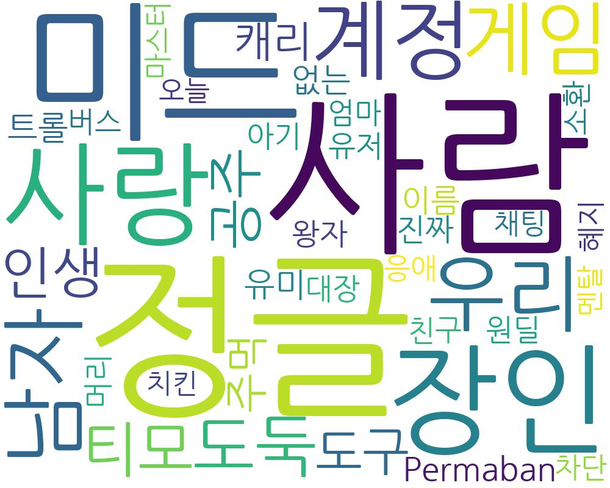

# Wordcloud of LoL Summoner Name

리그오브레전드 소환사 이름 기반 워드클라우드 분석

## 사용 데이터

- 리그오브레전드 소환사 이름 3,718,157건

## 워드클라우드 분석 결과

## 사용하기

- [Google Colab](https://colab.research.google.com/drive/18BSMn7PyDTUBq5CICuaCMZUczHQK1FRz?usp=sharing)
- [`.ipynb` file](/Wordcloud-of-LoL-Summoner-Name/Wordcloud_of_LoL_Summoner_Name.ipynb)
- [`.py` file](/Wordcloud-of-LoL-Summoner-Name/Wordcloud_of_LoL_Summoner_Name.py)

---

2022년 인트아이 여름 해커톤 "그로우업톤" - 인공지능 팀 참가 작품

 

